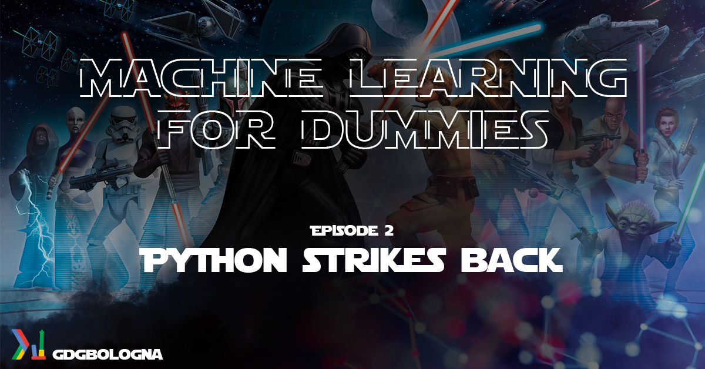

# Machine Learning For Dummies

## Index

<!-- TOC -->

- [Machine Learning For Dummies](#machine-learning-for-dummies)
    - [Index](#index)
    - [Episode 1: A Pythonic Hope](#episode-1-a-pythonic-hope)
        - [Information](#information)
        - [Contents](#contents)
    - [Episode 2: Python Strikes Back](#episode-2-python-strikes-back)
        - [Information](#information-1)
        - [Contents](#contents-1)
    - [Dates :calendar:](#dates-calendar)
    - [Show Some :heart:](#show-some-heart)

<!-- /TOC -->

## Episode 1: A Pythonic Hope

### Information

- **Type:** Talk
- **Level:** Beginner
- **Duration:** 2-3 Hours with a Break
- **Prerequisites:** Little bits of programming knowledge may help you understand some of the horrible jokes I make
- **Technical Requirements:** None
- **Materials:**
  - [Jupyter Notebook](https://github.com/mr-ubik/machine-learning-for-dummies/blob/master/Episode%201/episode_1.ipynb)
  - PDF - COMING SOON

### Contents

- Machine What?
  - Don't believe the hype
  - GG EZ
  - The Data Jedi Path
- Python: Learning to love Snakes
  - General overwiew of the language
  - Pythonic Syntax and Style
  - Pythonic Objects
    - Strings' Theory
    - Python as a calculator
    - Logical Python
    - Lists
    - Tuples
    - Dictionaries
  - Control Flow
    - if elif else
    - for
    - while + (break)
  - Functions
  - Libraries
- Use Python Luke!
  - Royal Rumble
  - The Python Ecosystem
  - Data Plumbing
  - Data Porn
  - This is not even my final form

## Episode 2: Python Strikes Back

### Information

- **Type:** Workshop
- **Level:** Beginner - Intermediate
- **Duration:** 2-3 Hours with a Break
- **Prerequisites:** Basic Python Notions (see [Episode 1: A Pythonic Hope](https://github.com/mr-ubik/machine-learning-for-dummies/blob/master/Episode%201/episode_1.ipynb))
- **Technical Requirements:**
  - Docker
  - Custom Docker Image (COMING SOON)
  - GitHub Account
  - [Join the machine-learning-for-dummies Gitter Room](https://gitter.im/machine-learning-for-dummies/GDG-Bologna?utm_source=share-link&utm_medium=link&utm_campaign=share-link) for all communications and technical discussion regarding the Machine Learning for Dummies series!
  - Watch (and if you like it :star:) the [Machine Learning For Dummies Repo](https://github.com/mr-ubik/machine-learning-for-dummies)
- **Materials:**
  - Custom Docker Image - COMING SOON
  - Jupyter Notebook - COMING SOON

### Contents

- Enter the Mad Scientist lab: IPython + Jupyter (lab)
- Numpy and the Masters of the vector-verse: From lists to vector
- Of Snakes and Pandas: Pandas Dataframe 101
- Nom Nom Nom: Ingesting Data
- Pandarellas - Becoming Cinderellas with Pandas 1: Cleaning
- Pandarellas - Becoming Cinderellas with Pandas 2: Transformation
- Bow Chicka Wow Wow: Introduction to Data Porn (also known as Data Visualization)

## Dates :calendar:

- [x] 25/11/2017 - Episode 1: A Pythonic Hope - @ImpactHub, Reggio Emilia, Italy
- [x] 30/11/2017 - Episode 1: A Pythonic Hope - @LuogoComune, Bologna, Italy
- [ ] 30/01/2018 - Episode 2: Python Strikes Back - @LuogoComune, Bologna, Italy

## Show Some :heart:

- [Check My Site](https://ubik.tech/)
- [Follow me on GitHub](https://github.com/mr-ubik/)
- [Add me on Likedin](https://linkedin.com/in/micheledesimoni)
- [Follow Me on Twitter](https://twitter.com/mr_ubik)
- [Like GDG Bologna Facebook Page](https://www.facebook.com/gdgbologna/?ref=br_rs)
- [Join GDG Bologna Facebook Group](https://www.facebook.com/groups/gdgbologna/)
- [Join GDG Bologna Telegram Channel](https://t.me/joinchat/B9zhTkMzwmoELNRqMS315g)
